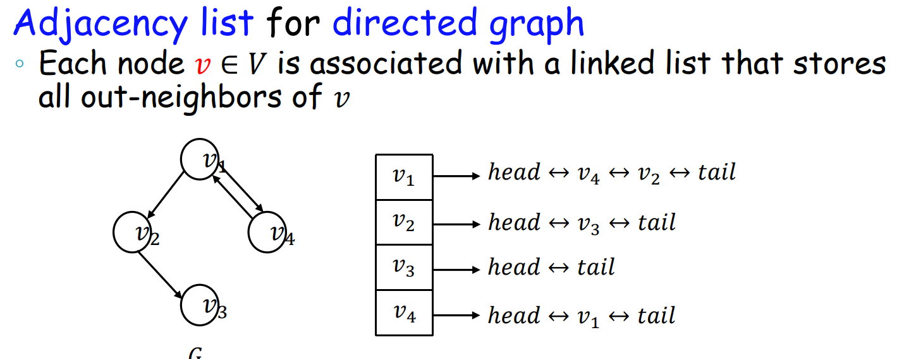
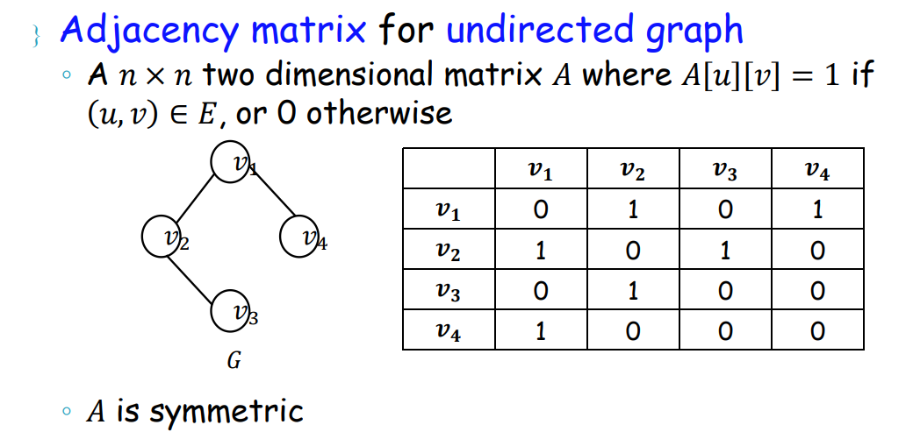
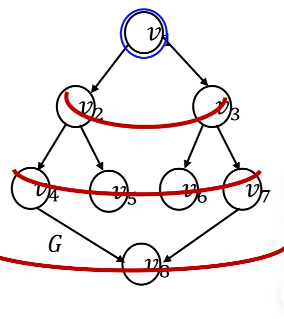

# Graphs, BFS, DFS

# **Graphs = Vertices + Edges + Representation + Traversal**

> Graph 本质：
> 
> 
> **描述“对象之间的关系”**
> 

## 一、Graph 的基本组成

### 1️⃣ Vertices（顶点）

- 记作 `V`
- 数量：`|V| = n`

---

### 2️⃣ Edges（边）

- 记作 `E`
- 数量：`|E| = m`
- 描述顶点之间的关系

## 二、Graph 的分类

### 1️⃣ 按方向

### **Undirected Graph（无向图）**

- 边是对称的
- `(u, v)` 和 `(v, u)` 等价

---

### **Directed Graph（有向图 / Digraph）**

- `(u, v)` ≠ `(v, u)`
- 有：
    - in-neighbor, in-degree
    - out-neighbor, out-degree

---

### 2️⃣ 按权重

### **Unweighted Graph**

- 边只有“有 / 无”

### **Weighted Graph**

- 每条边有 weight

## 三、术语（Terminologies）

### 1 Neighbor（邻居）

- 若两点之间有边，则互为邻居（无向图）

### 2 Out-neighbour / In-neighbour（有向图特有，重点！）

给定边：u → v

- **v 是 u 的 out-neighbour（出邻居）**
    - 从 u **沿出边一步能到达**的点
    - `Out(u) = { v | (u → v) ∈ E }`
- **u 是 v 的 in-neighbour（入邻居）**
    - 能 **一步走到 v** 的点
    - `In(v) = { u | (u → v) ∈ E }`

### 3 Degree（度）

- 无向：`d(v)` = 邻居数
- 有向：
    - `d_out(v)` = 出邻居数
    - `d_in(v)` = 入邻居数

### 4 Path / Simple Path / Cycle / Tree

- **Path**：一串点，相邻之间都有边
- **Simple Path**：除首尾外不重复
- **Cycle**：首尾相同的简单路径
- **Tree**：连通 + 无环 的无向图

## 四、Graph 表示方法

### 4.1 Adjacency List (邻接表，一般默认选择)

核心实现：每个点用linkedlist储存自己的out-neighbour（有方向）/储存自己的邻居（无方向）

- 有向邻接表



- 无向邻接表


java代码

```java
import java.util.*;

class Graph {
    int n;
    List<Integer>[] g;      // g[u] 存 u 的 out-neighbours（出邻居）
    int[] indeg;            // 需要入度时很常用（拓扑排序等）

    @SuppressWarnings("unchecked")
    Graph(int n) {
        this.n = n;
        g = new ArrayList[n];
        indeg = new int[n];
        for (int i = 0; i < n; i++) g[i] = new ArrayList<>();
    }

    // 有向边 u -> v
    void addEdgeDirected(int u, int v) {
        g[u].add(v);
        indeg[v]++; // v 的入度 +1
    }

    // 无向边 u -- v
    void addEdgeUndirected(int u, int v) {
        g[u].add(v);
        g[v].add(u);
    }
}

```

**空间/时间复杂度**

n为所有node的数量，m为所有edge的数量。k假设为指定vertex的另据的数量

| 空间复杂度 | O(n+m) |
| --- | --- |
| 检查一个edge是否存在 | O(k) |
| 获取一个node的所有neighbour | O(k) |
| 增加一个node | O(1) |
| 删除一个node | O(m) （因为要遍历所有edge才能把所有要删除的node的edge关系清除） |
| 增加一个edge | O(1) |
| 删除一个edge | O(k) |

*：稀疏图偏好用邻接表

### 4.2 Adjacency Matrix (邻接矩阵)

核心实现：矩阵可以容纳所有的node的可能的edge的关系，如果是邻居，那么A[u][v]就会有对应数值

- 有向邻接矩阵


- 无向邻接矩阵



java代码

```java
int[][] A = new int[n][n];
A[u][v] = 1;      // 有向 u->v
A[v][u] = 1;      // 若无向图再补一条

```

**空间/时间复杂度**

n为所有node的数量，m为所有edge的数量。k假设为指定vertex的另据的数量

| 空间复杂度 | O(n^2) |
| --- | --- |
| 检查一个edge是否存在 | O(1) |
| 获取一个node的所有neighbour | O(n) |
| 增加一个node | O(n^2)(需要重建一个新的matrix) |
| 删除一个node | O(n^2) （同上） |
| 增加一个edge | O(1) |
| 删除一个edge | O(1) |

# BFS (Breadth-First Search)

### 思想：从源点 s 出发，按“层”扩散：先访问距离更近的点



### 数据结构：Queue

### 代码展示（该示例用邻接表实现）

```java
import java.util.*;

static int[] bfs(List<Integer>[] g, int s) {
    int n = g.length;

    // vis[v] = true  表示 v 已被发现（discovered）
    // 在三色模型中：gray 或 black
    boolean[] vis = new boolean[n];

    // dist[v] = 从源点 s 到 v 的最短路径长度（边数）
    // dist[v] = -1 表示尚未被访问（white）
    int[] dist = new int[n];
    Arrays.fill(dist, -1);

    // BFS 使用队列：先进先出，保证按“层”访问
    Queue<Integer> q = new ArrayDeque<>();

    // 初始化：将源点 s 入队
    q.add(s);
    vis[s] = true;   // s 被发现（white -> gray）
    dist[s] = 0;     // s 到自身距离为 0

    // 主循环：直到所有可达节点都被访问
    while (!q.isEmpty()) {
        int u = q.poll();   // u 出队，开始处理 u 的邻居

        // 遍历 u 的所有出邻居（out-neighbours）
        for (int v : g[u]) {
            // 如果 v 尚未被发现
            if (!vis[v]) {
                vis[v] = true;          // v 被发现（white -> gray）
                dist[v] = dist[u] + 1;  // BFS 层数 +1
                q.add(v);               // v 入队，等待后续处理
            }
        }
        // 在三色模型中，这一刻 u 变为 black（已完成）
    }

    // 返回从 s 到每个节点的最短距离
    return dist;
}

```

**复杂度**

- 每点最多入队/出队一次
- 每条边最多检查一次
    
    ⇒ **O(n + m)**
    

# DFS (Depth-First Search)

### 思想

> 一条路走到黑，走不动就回溯
> 

### 两种写法

- 递归（最常用）
- 显式栈（课堂讲义）

### DFS 递归模板（常用）

```java
static void dfs(int u, List<Integer>[] g, boolean[] vis) {
vis[u] = true;
for (int v : g[u]) {          // out-neighbour
if (!vis[v]) dfs(v, g, vis);
}
}
```

### DFS 显式栈版

```java
import java.util.*;

static void dfsStack(List<Integer>[] g, int s) {
    int n = g.length;
    int[] color = new int[n]; // 0=white, 1=gray, 2=black
    int[] it = new int[n];    // 指向“扫描到第几个邻居”的指针（关键技巧）

    Deque<Integer> st = new ArrayDeque<>();
    st.push(s);
    color[s] = 1; // gray

    while (!st.isEmpty()) {
        int u = st.peek();

        // 找 u 的下一个白色邻居
        while (it[u] < g[u].size() && color[g[u].get(it[u])] != 0) {
            it[u]++;
        }

        if (it[u] < g[u].size()) {
            int v = g[u].get(it[u]++);
            color[v] = 1; // gray
            st.push(v);
        } else {
            st.pop();
            color[u] = 2; // black
        }
    }
}

```

### DFS 复杂度（邻接表）

同理每条边最多被检查一次：

⇒ **O(n + m)**

### DFS性质（时间戳）

### 定义

- `d[u]`：discover time（第一次到 u）
- `f[u]`：finish time（从 u 回溯完成）

区间：

I(u) = [d(u), f(u)]

### 核心性质

对任意 u, v：

- `I(u) ⊂ I(v)` ⇒ u 是 v 的后代
- `I(v) ⊂ I(u)` ⇒ v 是 u 的后代
- `I(u) ∩ I(v) = ∅` ⇒ 互不为祖先/后代

### Java 模板（带时间戳）

```java
static int time;
static int[] d, f;

static void dfsTime(int u, List<Integer>[] g, boolean[] vis) {
    vis[u] = true;
    d[u] = ++time;

    for (int v : g[u]) {
        if (!vis[v]) dfsTime(v, g, vis);
    }

    f[u] = ++time;
}

```
