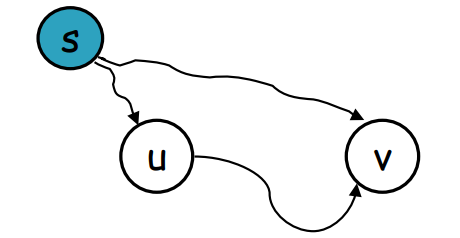
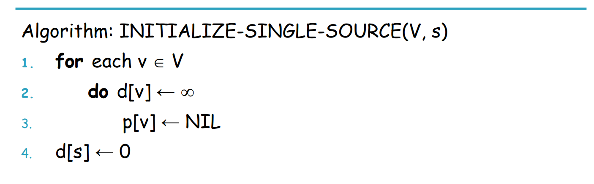
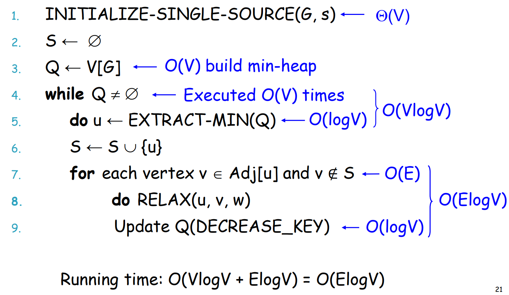

# Graph Shortest Path (1) (Single-Source)

## 一、基本概念

### 1. Shortest Path

给定带权有向图 G=(V,E)，权重函数 w，源点 s。

最短路径定义为：

$$
\delta(s,v)=\min_{p:s\rightsquigarrow v}\sum w(e)
$$

目标：计算所有点 v 的 δ(s,v)

---

### 2. 重要性质

- **最优子结构**
    
    最短路径的任意子路径仍是最短路径。
    
- **环的性质**
    - 存在负权环 ⇒ 最短路径无定义
    - 正权环不会出现在最短路径中
- **松弛不等式（核心）**

$$
\delta(s,v)\le \delta(s,u)+w(u,v)
$$




## 二、理论基础：Relaxation Property

### 1. 上界视角

算法维护的不是 δ(s,v)，而是上界 `d[v]`，始终满足：

$$
d[v]\ge \delta(s,v)
$$

---

### 2. Relaxation（松弛）

对每条边 (u,v)：

```
if d[v] > d[u] + w(u,v)
    d[v] = d[u] + w(u,v)
```

所有最短路算法的区别仅在于：**松弛的顺序不同**。

## 三、无权图最短路径：BFS

### 1. 适用条件

- 所有边权相同（通常视为 1）

---

### 2. 核心思想

- 按“边数层级”推进
- 第一次到达某点即为最短路径

---

### 3. 不变量

- 队列中点的 `dist` 单调不减
- 出队即定案

---

### 4. 代码模板（Java）

```java
static int[] bfsShortestPath(List<Integer>[] g, int s) {
    int n = g.length;
    int[] dist = new int[n];
    Arrays.fill(dist, -1);

    Queue<Integer> q = new ArrayDeque<>();
    dist[s] = 0;
    q.add(s);

    while (!q.isEmpty()) {
        int u = q.poll();
        for (int v : g[u]) {
            if (dist[v] == -1) {
                dist[v] = dist[u] + 1;
                q.add(v);
            }
        }
    }
    return dist;
}

```

### 5. 时间复杂度

O(V+E)

## 四、带权图最短路径：Dijkstra

### 1. 适用条件

- **所有边权非负**

---

### 2. 核心思想（点驱动）

- 维护集合 S：最短距离已确定的点
- 每次选取 `d` 最小的未确定点加入 S
- 用该点进行松弛

---

### 3. 不变量（最关键）

- 对任意 u∈S，`d[u] = δ(s,u)`
- 对任意 v∉S，`d[v]` 是最短路上界

---

### 4. 关键变量

- `d[v]`：最短距离上界
- `visited[v]`：是否已定案
- `PQ`：按 `d` 排序的最小堆

---

### 5. 代码模板（Java，PriorityQueue）

```java
static class Edge {
    int to, w;
    Edge(int to, int w) {
        this.to = to;// the vertex it connect to
        this.w = w; // the weight 
    }
}

static long[] dijkstra(List<Edge>[] g, int s) {
    int n = g.length;
    long INF = Long.MAX_VALUE / 4;

    long[] dist = new long[n];
    Arrays.fill(dist, INF);   // 所有的distance都先用infnity 填充
    dist[s] = 0;  //源头距离为0

    boolean[] visited = new boolean[n];  
    PriorityQueue<long[]> pq = 
        new PriorityQueue<>(Comparator.comparingLong(a -> a[0]));  //搭建一个以可源头的距离为比较的heap
    // a[0] = dist, a[1] = vertex

    pq.add(new long[]{0, s});  

    while (!pq.isEmpty()) {
        long[] cur = pq.poll();
        long d = cur[0];
        int u = (int) cur[1];//extract-min 得到现在的最优解

        if (visited[u]) continue; //如果已经加入路径中，则跳过
        visited[u] = true;

        for (Edge e : g[u]) {  // 还有一个g[u]储存所有的邻居
            int v = e.to;
            if (d + e.w < dist[v]) {
                dist[v] = d + e.w;
                pq.add(new long[]{dist[v], v});
            }
        }
    }
    return dist;
}

```

伪代码逻辑






### 6.时间复杂度

$$
O(E logV)
$$

### 7.有效性证明

> 反证法标准套路
> 
1. 假设 u 是第一个被加入 S，但 d[u]≠δ(s,u)
2. 取真实最短路径 s→⋯→⋯→u
3. 找到路径上第一个不在 S 的点 y
4. 其前驱 x 已在 S，且已被正确计算
5. 松弛时应有：

$$
d[y] \le \delta(s,y) < \delta(s,u) < d[u]
$$

1. 与u 是 “Extract-Min”矛盾

## 五、模型转化：最大可靠性路径

### 1. 原问题

- 边可靠性 r(u,v)∈(0,1]
- 路径可靠性为乘积最大

---

### 2. 转化

w(u,v)=−log ⁡r(u,v)

- 权重非负
- 直接使用 Dijkstra
